## Έξυπνος κάδος διαχώρισης πλαστικού και μετάλλου
### Το πρόβλημα
Τα πλαστικά βρίσκονται παντού γύρω μας. Στην Ελλάδα παράγονται κάθε χρόνο 940.000 τόνοι πλαστικού, δηλαδή 40 περίπου φορές όσο το βάρος του Παρθενώνα! Το 84% των πλαστικών απορριμμάτων καταλήγει στις χωματερές. Η ρύπανση επηρεάζει σοβαρά τα χερσαία οικοσυστήματα, τις θάλασσές μας και την ίδια μας την υγεία. Ότι καταλήγει στο περιβάλλον επιστρέφει στον ίδιο μας τον οργανισμό μέσω της τροφικής αλυσίδας. Για να αποκτήσουν τα παιδιά μας οικολογική συνείδηση, χρειάζονται μικρές, καθημερινές “πράξεις σεβασμού” προς στο περιβάλλον. Μπορούν να υιοθετήσουν τη συνήθεια της ανακύκλωσης των πλαστικών μπουκαλιών που χρησιμοποιούν στο χώρο του σχολείου βοηθώντας στην  διατήρηση της καθαριότητας  της αυλής του σχολείου τους.
### Σκοπός Project
Οι μαθητές με την χρήση της τεχνολογίας να αποκτήσουν οικολογική συνείδηση δημιουργώντας έναν έξυπνο κάδο. Ο έξυπνος κάδος διαχωρίζει το πλαστικό από το μέταλλο. Θα τοποθετηθεί στην αυλή του σχολείου όπου οι μαθητές τοποθετώντας ένα αντικείμενο θα αναγνωρίζει αν είναι πλαστικό ή μέταλλο και θα το διαχωρίζει. 

### Σχεδιασμός  Project
Για την δημιουργία του Project  θα χρησιμοποιηθεί η   πλακέτα Micro:bit.  Ο κάδος θα είναι κατασκευασμένος  από χαρτόνι.  Όταν τοποθετεί ένας μαθητής  ένα αντικείμενο  το αυτόματο σύστημα διαχωρισμού θα το τοποθετεί στον αντίστοιχο κάδο ανάλογα αν είναι πλαστικό ή μέταλλο.  Για την υλοποίηση του project δεν θα χρησιμοποιηθούν έτοιμοι αισθητήρες του εμπορίου για την αναγνώριση των υλικών(πλαστικό/μέταλλοο).  Με την χρήση απλών υλικών(αλουμινόχαρτο ,καλώδια) οι μαθητές θα φτιάξουν τους δικούς τους αισθητήρες.  Το project με αυτό τον τρόπο θα γίνει πιο απλό και κατανοητό στους μαθητές και θα μειωθεί το κόστος κατασκευής του. 
Προτείνεται στο συγκεκριμένο project η πλακέτα Micro:bit για το χαμηλό κόστος, την ευκολία προγραμματισμού από μαθητές δημοτικού και της ενσωματωμένες δυνατότητες όπου διαθέτει (Radio σήματα, Led οθόνη, αναγνώριση κλειστού κυκλώματος) . Κατά προτίμηση θα χρησιμοποιηθούν ανακυκλώσιμα υλικά για να εξυπηρετηθεί ο σκοπός του project.

### Τρόπος  εργασίας των μαθητών
Οι μαθητές εργάστηκαν σε ομάδες. Κάθε ομάδα είχε και από ένα micro:bit  όπου  δούλεψε πάνω στον προγραμματισμό του έξυπνου κάδου μέσω 4ων δραστηριοτήτων ενός φύλλου εργασίας όπου τους δόθηκε.
Στην αρχή γνώρισαν την λειτουργία του servo motor μέσω μιας ρομποτικής δαγκάνας όπου την ανοιγόκλειναν. Στην συνέχεια γνώριζαν την λειτουργία του κλειστού κυκλώματος. Πιάνοντας τους δυο ακροδέκτες του micro:bit με τα δάχτυλα τους δημιουργώντας ένα κλειστό κύκλωμα με το σώμα τους αναβόσβηνε μια καρδιά στο micro:bit. Στο τέλος πειραματίστηκαν με την λειτουργία του αισθητήρα υπέρηχων απόστασης βάζοντας ένα αντικείμενο μπροστά τους όπου εμφανιζόταν μια καρδιά στο micro:bit όταν αναγνώριζε αντικείμενο σε κοντινή απόσταση. Με την κυρία της τάξης τους  συζήτησαν για την ανακύκλωση και τα οφέλη που προσφέρει. Στο τέλος ζωγράφιζαν μέσα στην τάξη τον έξυπνο κάδο.

### φύλλο εργασιας
Φύλλο εργασίας 4ων δραστηριοτήτων 

### Υλοποίηση Project
 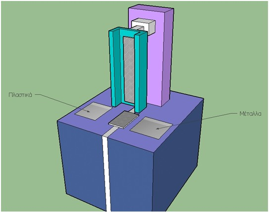
 
### Έξυπνος κάδος
Ο έξυπνος κάδος διαχωρίζει τα πλαστικά από τα μέταλλα. Όταν τοποθετείτε ένα αντικείμενο στον κάδο το έξυπνο σύστημα διαχώρισης ελέγχει αν το αντικείμενο είναι πλαστικό ή μέταλλο και το τοποθετεί στον αντίστοιχο κάδο.
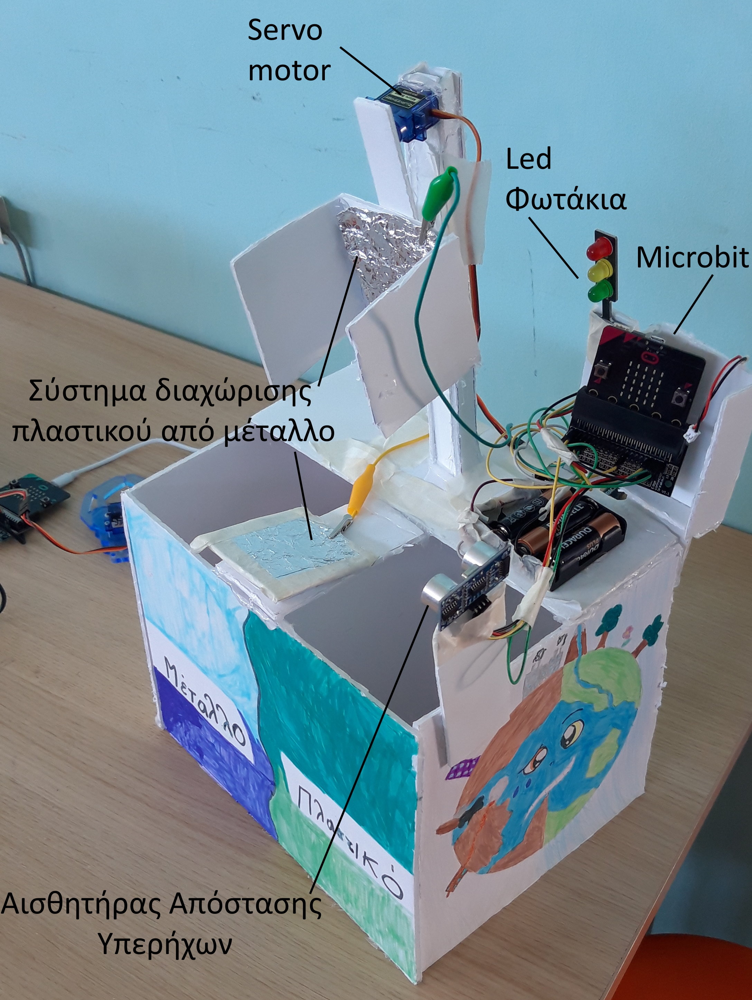
### Σύστημα διαχώρισης πλαστικού από μέταλλο.

Το έξυπνο σύστημα διαχώρισης αντικειμένων ελέγχει αν δημιουργείτε κλειστό κύκλωμα όταν τοποθετείτε ένα αντικείμενο. Υπάρχει ένα αλουμινόχαρτο στην κάτω πλευρά και στα πλάγια του συστήματος διαχώρισης. Όταν τοποθετείτε ένα μέταλλο ανιχνεύει κλειστό κύκλωμα και το αντικείμενο τοποθετείτε στην πλευρά των μετάλλων διαφορετικά τοποθετείτε στην πλευρά των πλαστικών. Ένα servo μοτέρ περιστρέφει  αριστερά η δεξιά το σύστημα διαχώρισης ανάλογα με το αν ανιχνεύει μέταλλο ή όχι.

### Κώδικας
Tο περιβάλλον MakeCode είναι απλό και προσιτό σε μαθητές δημοτικού (μπορείτε να το βρείτε στη διεύθυνση https://makecode.microbit.org/# ).  Αυτό θα χρησιμοποιήσουμε στη συνέχεια. 

Διάγραμμα ροής του έξυπνου κάδου

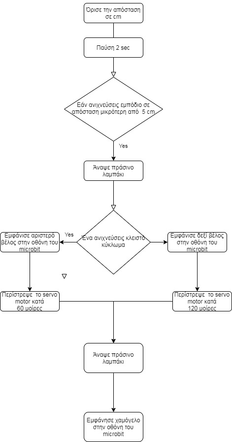

Ο κώδικας για την υλοποίηση του έξυπνου κάδου

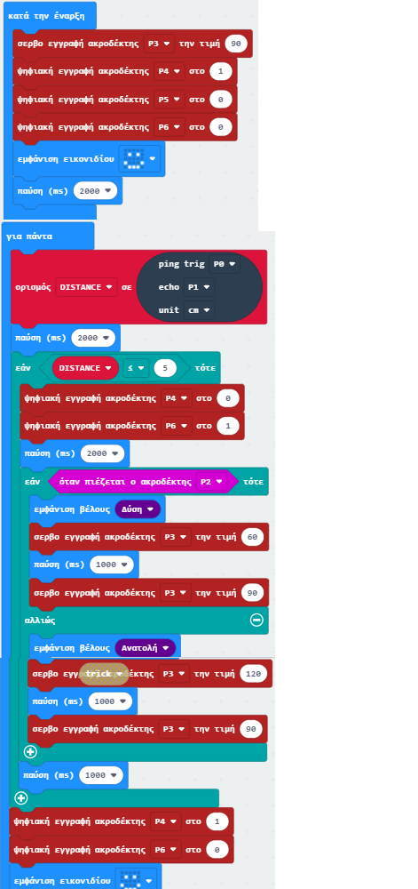

Το κύκλωμα με το λογισμικό σχεδίασης Fritzing

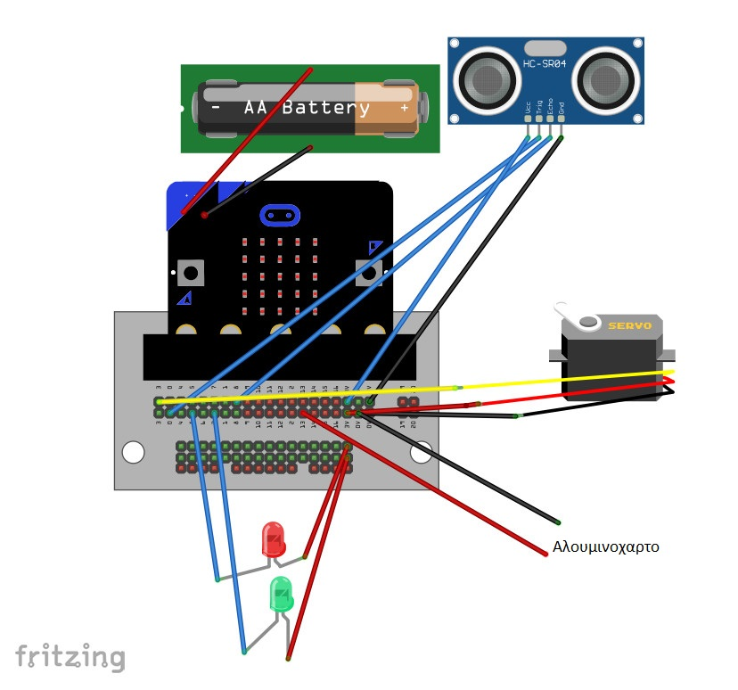

### Υλικά
1.	BBC micro:bit Board 18,90€
2.	Μπαταριοθήκη 3xΑΑ με JST PH  0,80€
4.	Servo Micro 2.2kg.cm Plastic Gears 3,60€
5.	Traffic Light for BBC micro:bit 5€
6.	Αισθητήρας Υπερήχων 5€
7.	Jumper Wires 15cm 2€
8.	Edge Connector Breakout Board for BBC micro:bit - Pre-built 6€
Σύνολο: 41 €

### Παρουσίαση Youtube

### Φωτογραφικό Υλικό
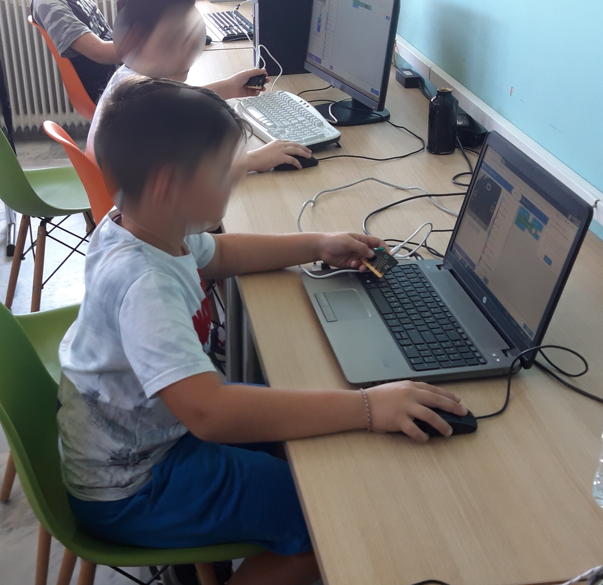

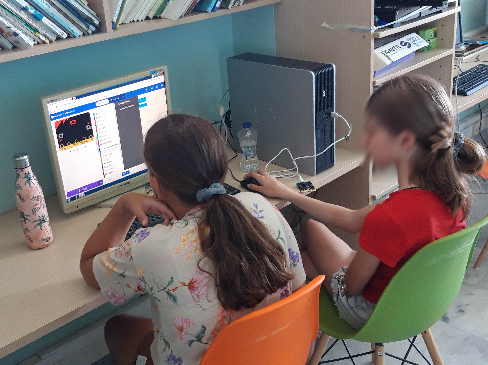

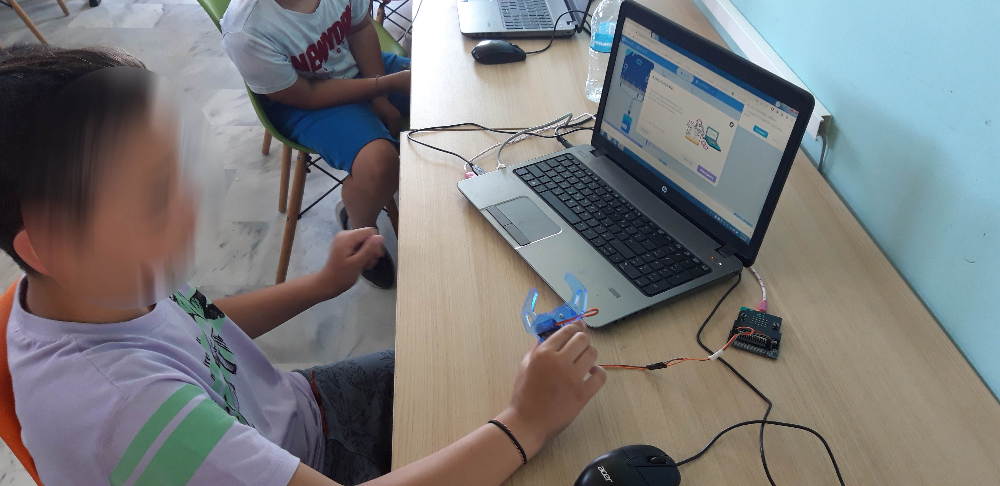

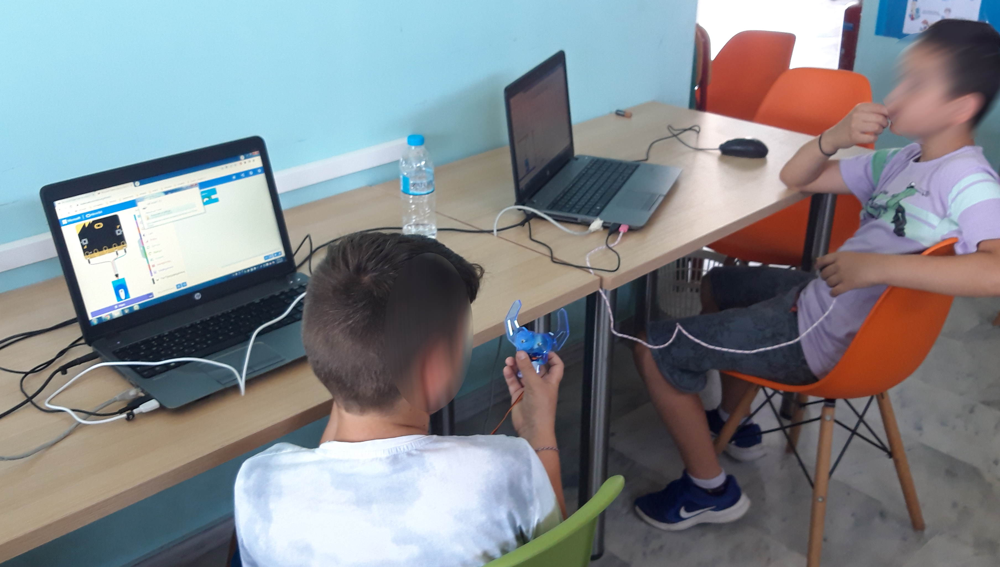

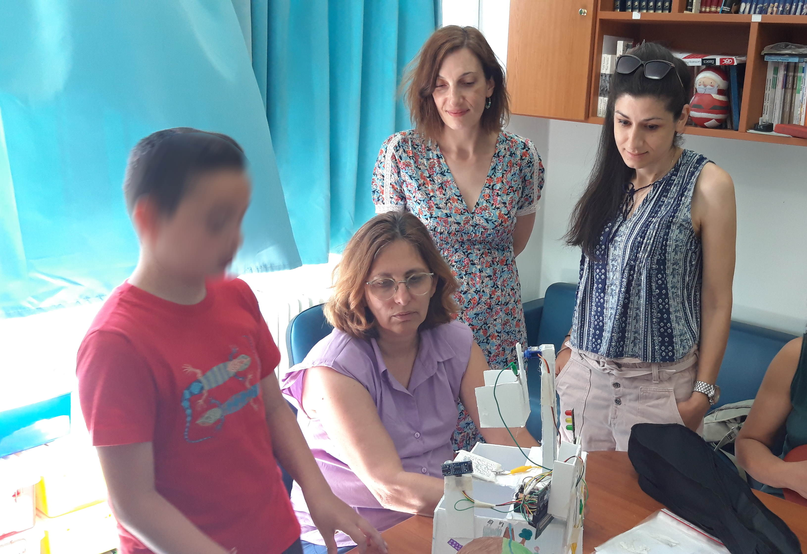

Ανακύκλωση στην αυλή του σχολείου

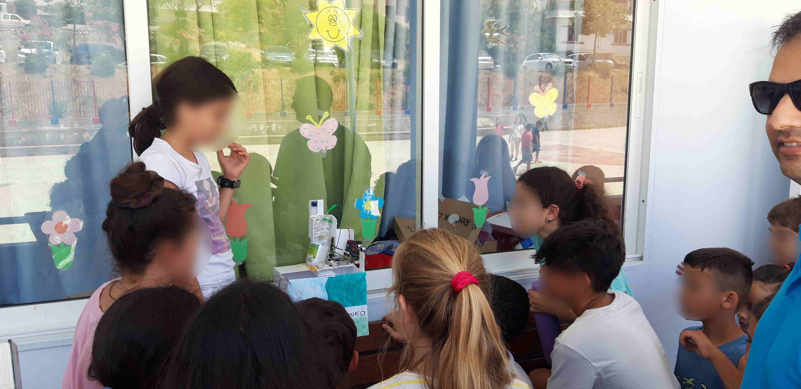
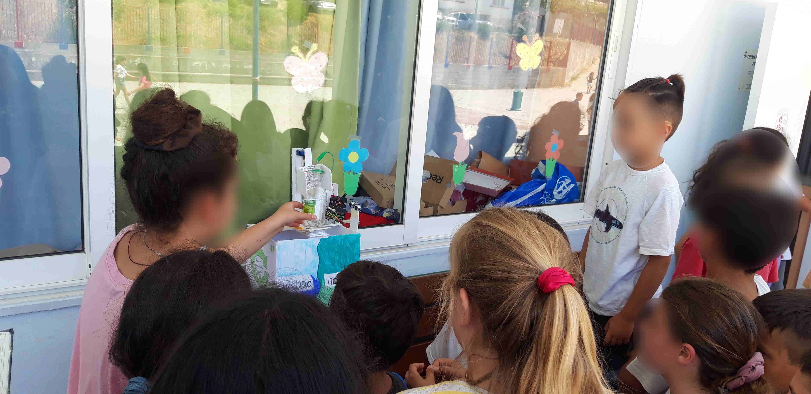

### Μελλοντικές επεκτάσεις
Με ένα δεύτερο micro:bit όπου θα επικοινωνεί με ραδιοκύματα με τον έξυπνο κάδο μπορεί να χρησιμοποιηθεί και ως ρολόι χειρός.  Θα μας ειδοποιεί για την πληρότητα του κάδου κάθε φορά που τοποθετιέται  ένα αντικείμενο 

### Συμπεράσματα
Με ανακυκλώσιμα υλικά μπορούμε να φτιάξουμε ένα απλό κάδο χαμηλού κόστους  συνδυάζοντας απλές αρχές προγραμματισμού και φυσικής. Οι μαθητές μπόρεσαν να καταλάβουν τον τρόπο λειτουργίας του κάδου και δεν δυσκολεύτηκαν να κατανοήσουν τον τρόπο προγραμματισμού του. Ενθουσιάστηκαν με το γεγονός ότι ο κάδος διαχώριζε το πλαστικό από το μέταλλο χωρίς να πατήσουν κανένα κουμπί.

Αυτή η εργασία χορηγείται με άδεια Creative Commons Αναφορά Δημιουργού – Παρόμοια Διανομή 4.0 Διεθνές .

